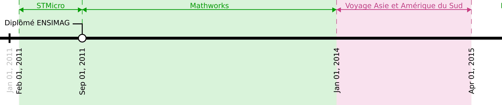
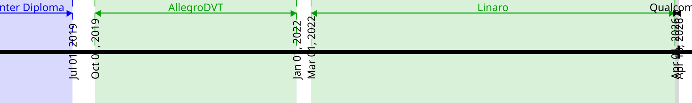

Pierrick Bouvier, Ingénieur R&D C++/D/Rust
==========================================

+------------------------------------------------------------------------------+
|:Actuellement: Ingénieur R&D chez AllegroDVT                                  |
|:Âge: AGE_KK                                                                  |
|:Adresse: Grenoble                                                            |
|:Téléphone: 06 72 14 82 97                                                    |
|:Email: pierrick.bouvier@posteo.net                                           |
|:Permis: B (avec véhicule)                                                    |
|:Site: https://second-reality.github.io                                       |
|:Github: https://github.com/second-reality                                    |
|:Mis à jour: DATE_KKK                                                       |
|:CV en ligne: https://github.com/second-reality/cv/blob/master/cv.pdf         |
+------------------------------------------------------------------------------+

Ce que j'aime
-------------

Développer une vision d'ensemble, analyser des problèmes et créer de nouvelles
expériences utilisateur. J'aime apporter un regard neuf sur des choses qui
semblent figées, et les améliorer.

À la recherche de nouveaux challenges techniques et des solutions qui
s'inscrivent dans ma façon de développer (Keep It Simple, Stupid), avec un
outillage digne de notre temps (et la ligne de commande en fait partie
intégrante!). Le tout à partager avec une équipe pour qui ces problématiques
sont présentes, et qui a un certain goût pour la philosophie Unix,
l'automatisation des outils et la qualité.

J'ai également un attrait particulier pour les problématiques de bas niveau, et
les systèmes complexes nécessitant de la performance et de la robustesse.

Mon langage de prédilection est le D (après plusieurs années en C++ moderne). Je
suis également en train d'apprendre en profondeur Rust.

Formation
---------

:2008 - 2011:

  Cycle ingénieur Filière Ingénierie des Systèmes d’Information (Mention B) au
  sein de l'école **GrenobleINP Ensimag**

:2006 - 2008:

  Licence Sciences et Technologies Informatique et Mathématiques (Mention TB) à
  l'Université Joseph Fourier de Grenoble

Compétences
-----------

:Langages (maîtrisés):

  D, C++(17), C(99), Bash, CUDA(7)/OpenCL(1.2), reStructuredText (documentation)

:Langages (survolés):

  Rust, Python, asm x86

:Librairies C++:
  STL, Boost (algorithmes, conteneurs, Asio, Test), Qt

:Atouts:
  Architecture, algorithmes, système, gestion mémoire, programmation parallèle,
  performance, gpgpu, automatisation, build, intégration continue

:Systèmes:

  Unix (Linux - Debian/Slackware, BSD - FreeBSD), Windows (7, 10)

  Bonnes connaissances en administration de machines tournant sous ces systèmes.
  Je peux déployer tous les outils cités ci-dessous.

:Outils (dev):

  Bash, Vim, Git, GNU toolchain, GNU coreutils, Clang, Meson

:Outils (équipe):

  Redmine, Gitlab, Jenkins CI, CGit, Docker

:Outils (infrastructure):

  Proxmox (virtualisation), BorgBackup (sauvegarde), Wireguard (vpn)

:Langues:

  Anglais parlé et écrit couramment (TOEIC: 925/990).

  Espagnol parlé couramment.

Expériences
-----------

Résumé
++++++

Détails
+++++++

:Depuis Octobre 2019:

   Ingénieur R&D chez **AllegroDVT**.

   Génération de streams de conformité sur les nouveaux standards vidéos
   (H.266/VVC).

   Design et développement de nouveaux générateurs vidéos (orientés grammaire).

   Contribution aux standards vidéos (implémentation de référence,
   spécification).

   Introduction, formation, développement et maintenance des outils de travail
   de l'équipe pour permettre l'intégration continue (Utilisation de
   git/meson/jenkins). Création d'un environnement reproductible (basé sur
   docker) pour abstraire les machines des développeurs.
   
   Participation à l'IT de l'entreprise, aide au déploiement d'une
   infrastructure de virtualisation et d'une solution de sauvegarde.

   Utilisation du Rust, D, C++17, Bash. Travail sous Linux uniquement.

--------------------------------------------------------------------------------

:Mai 2018 - Juin 2019:

  **CAP Charpente**, à la Fédération compagnonnique de Grenoble.

  Préparation du projet avec Pôle Emploi, réalisation de 3 stages d'immersion
  d'un mois, puis le CAP, comprenant 2 stages d'un mois.

  Ce CAP a été l'occasion d'apprendre un métier manuel, désir que j'avais depuis
  longtemps, et d'en découvrir les avantages et les inconvénients comparé à mon
  métier d'ingénieur. C'était une expérience importante pour ma vie
  professionnelle.

--------------------------------------------------------------------------------

:Janvier - Mars 2018:

  **Voyage en Colombie de 3 mois.**

  Découverte d'un bien beau pays que j'avais envie d'explorer depuis longtemps.
  L'occasion de connaître plus de la culture latine, de perfectionner mon
  espagnol, et aussi, de faire un point dans ma vie.

--------------------------------------------------------------------------------

:Février - Décembre 2017:

  Ingénieur de recherche en CDD chez **INRIA** à Grenoble, au sein de l'équipe
  CORSE, travaillant sur des problématiques de compilation et d'optimisation de
  programmes.

  Extension de GDB (via Python) pour ajouter la possibilité de contrôler des
  plugins d'instrumentation QEMU via l'interface gdbserver.

  Développement d'un outil d'aide à l'analyse de performances (profiling) par
  instrumentation binaire basé sur QEMU, nommé program profiler (pp).

  Travail sur les projets QEMU et DynamoRIO (code disponible sur mon github_)

  Utilisation du C++14, Python.

.. _github: https://github.com/second-reality/qemu/

--------------------------------------------------------------------------------

:Octobre 2016 - Janvier 2017:

  Ingénieur R&D chez **Mentor Graphics** à Montbonnot.

  Développement d'un simulateur de circuits électroniques. J'ai mis fin à ma
  période d'essai car le poste ne correspondait pas à mes attentes.

  Utilisation du C++14, Bash, Boost, CMake.

--------------------------------------------------------------------------------

:Février - Octobre 2016:

  Ingénieur R&D chez **Kaizen Solutions** en prestation chez **Thales Electron
  Devices à Moirans**.

  Développeur (seul) sur un projet de R&D visant à porter une chaîne de
  traitement d'images sur GPGPU (via CUDA/OpenCL). L'enjeu est de réduire la
  consommation de l'unité de traitement. Plusieurs boards ont été évaluées
  (principalement à base de processeurs ARM et de différents GPGPU (DSP, GPU)).
  Une partie importante du travail a été d'optimiser le code.

  Écriture d'algorithmes de traitement d'images (portage depuis une version CPU
  ou de spécifications). Portage de CUDA vers OpenCL (à performance égale sur
  les plateformes offrant les deux) avec une solution technique garantissant
  l'utilisation du même code (via des macros - dans le style de Boost.Compute).
  Code de communication réseau pour la transmission d'images. Mise en place de
  chaînes de cross compilation, d'un script de build, de déploiement, de
  test et de profiling.

  Autoformation CUDA/OpenCL et sur les problématiques de programmation sur
  GPGPU.

  Utilisation du C++14, Cuda(7), OpenCL(1.2), Bash, Boost (Asio), SDL, CMake.
  Travail sous Linux uniquement.  Développement x86_64, arm, et arm64.

--------------------------------------------------------------------------------

:Août 2015 - Janvier 2016:

  Ingénieur au **Centre de Recherche et Développement Nicolas Bourbaki à
  Montbonnot-Saint-Martin**.

  Développeur sur le projet SpherNet, visant à offrir une solution de
  communication complète pour les objets connectés (réseau LoRa). Équipe de 6
  personnes, et projet partant d'une feuille blanche.

  Architecture de notre solution, choix des technologies utilisées, conseils
  techniques à l'équipe, le tout sur fond de C++ moderne (14). Développement sur
  toutes les parties du projet.

  Mise en place d'outils pour l'équipe (intégration continue, revue de code), de
  coding style et d'un workflow de travail. Création d'un environnement de
  développement reproductible basé sur Debian.

  Utilisation du C++14, Bash, Boost (Asio, Log, UnitTest), programmation
  asynchrone (Proactor Pattern). Travail sous Linux uniquement.

  Licenciement économique suite à une liquidation totale de l'entreprise.

--------------------------------------------------------------------------------

:Janvier 2014 - Mars 2015:

  **Voyage en Asie et en Amérique du Sud: Inde, Cambodge, Laos, Vietnam,
  Philippines, Singapour, Malaisie, Thaïlande, Népal, passage par la France,
  Brésil, Bolivie, Pérou et Équateur.**

  Des rencontres fantastiques, un monde complètement différent, une Nature
  exceptionnelle et une vision à jamais changée sur la vie, mon pays et tout ce
  qui m'entoure.

--------------------------------------------------------------------------------

:Septembre 2011 - Janvier 2014:

  **Ingénieur compilation chez MathWorks (qui produit MATLAB)
  à Montbonnot-Saint-Martin. Evolution de l’analyseur statique de code C/C++
  Polyspace.**

  Travail sur le front-end (compilation) et l’architecture des produits
  Polyspace (Bug Finder et Code Prover).

  Création d'un outil de configuration automatique basé sur de l'injection de
  code lors du build du client (via LD_PRELOAD sous Linux/MacOS et IAT patching
  sous Windows). Cela a permis le déploiement de Polyspace dans tout MathWorks
  ainsi que chez de nombreux clients. Une configuration manuelle pouvait
  nécessiter plusieurs heures et ne garantissait pas un résultat toujours fiable
  dans ce qui est compilé.

  Mise en place seul de Git et d'intégration continue au sein de l’équipe suite
  à une initiative personnelle. Détection automatique de nouveaux bugs (grâce à
  l'utilisation scriptée de git bisect) et productivité améliorée pour tous.
  Outils utilisés en complément des officiels fournis par l'entreprise.

  Utilisation du Standard ML, C99, C++11, Bash, de Boost, de la WinAPI et de
  beaucoup de librairies internes sur du code de plusieurs centaines de milliers
  de lignes. Travail multiplateforme Windows/Linux/MacOS en 32/64 bits. Anglais
  utilisé au quotidien.

--------------------------------------------------------------------------------

:Février - Août 2011:

  **Stage de fin d’études Ensimag au sein de l'équipe compilation de
  STMicroelectronics à Grenoble.**

  Réalisation d’un logiciel permettant d’analyser la structure de grands projets
  (Linux, LLVM, ...) au niveau binaire afin d’aider les développeurs à
  comprendre et modifier ceux-ci.

  Utilisation du C99, XML et de la libelf et libdwarf.

--------------------------------------------------------------------------------

:Juillet - Août 2010:

  **Stage de fin de deuxième année Ensimag chez Aesculap à Échirolles.**

  Conception, implémentation et validation d’un module de reconnaissance vocale
  pour un système de chirurgie assistée par ordinateur (Orthopilot). Tests
  réalisés en conditions réelles durant deux opérations au CHU de la Tronche.

  Utilisation du C++03, de la Microsoft SpeechAPI et du framework Qt.

--------------------------------------------------------------------------------

:2007 - 2010:

  **Vendeur cycles chez Decathlon à La Tronche.** (10h/sem période scolaire -
  35h/sem été). Une première expérience du commerce qui m'a appris beaucoup en
  complément de mes études.

Personnel
---------

* Pratique régulière des sports de montagne: alpinisme, escalade, vélo de
  montagne, randonnée, ski.

* Lecture, cinéma

* Moto

* **Suivi de l’actualité informatique (hardware & software), du logiciel libre
  et des nouveaux outils et langages disponibles.**

* **Passionné par ce que je fais, autonome, curieux et avec une grande soif
  d'apprendre.**
