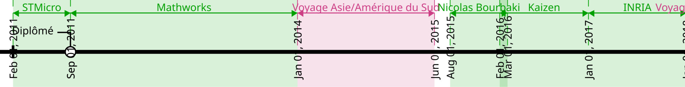

Pierrick Bouvier, Software Engineer
===================================

AGE_KK years, Vancouver, Canada (since April 2024) |
French citizen, Canadian PR

Phone: 672-962-0381 | Email: pierrick.bouvier@posteo.net |
Github: `second-reality <https://github.com/second-reality>`_ |
`pbo-linaro <https://github.com/pbo-linaro>`_ (pro)

Currently: Senior Software Engineer at `Linaro <https://www.linaro.org>`_,
working on `QEMU <https://www.qemu.org/>`_

Skills
------

:Programming:

  C++, C, `D <https://dlang.org/>`_, Bash | *Progressing*: Rust, Python

:C++ Libraries:

  STL, Boost (Containers, Asio, Test), GoogleTest, Qt

:Knowledge:

  Architecture, Algorithms, Parallelism, Performance analysis | IT, Automating, Build, Tests, CI/CD

:Tools (dev):

  Bash, Vim, Git | GNU toolchain, Clang, Meson, CMake

:Tools (team):

  Gitlab, Docker

:Systems:

  Linux (Debian) | Windows

:Languages:

  English: spoken and written fluently | French: native | Spanish: spoken fluently

Experience
----------

.. image:: ./cv_timeline01.jpg
   :width: 100%
   :alt: timeline

**Senior Software Engineer at Linaro** full remote (since March 2022)

*Since February 2024:* `QEMU <https://www.qemu.org/>`_ developer (`patches <https://patchew.org/search?q=project:QEMU+from:pierrick.bouvier>`_)

C, Bash, Python, Rust | Gitlab, Meson

- Arm support (cpu and SMMU features)
- Enhance instrumentation plugins
- Reviews around code generation/Arm support/plugins

*Before:* Port open source projects to Windows on Arm (`WoA project <https://www.linaro.org/projects/windows-on-arm>`_)

C, C++, Python, Bash | Gitlab

- Contributed to: Dart/Flutter, v8, Node.js, LLVM, QEMU, Ruby, ...
- Setup a downstream CI based on GitLab
- Blog posts

|

**Software Engineer at AllegroDVT** in Meylan (2+ years)

Conception of `compliance streams
<https://www.allegrodvt.com/video-ip-compliance-streams/compliance-streams-validation-verification/>`_
to validate implementations of new video standards

D, C++17, Bash, Rust | Docker, Gitlab, Jenkins

- Technical lead for team (6 members)
- Architecture and development of a new video generation engine
- Development on new standards (AVS3, H.266/VVC)
- Internal training on our tools for other teams
- Migrate to git (+ gitlab) and team training
- Implementation of an *efficient* CI (< 10 min) and merge requests based workflow
- Full automation of production chain (CD) in "one click"!

|

**Carpenter Diploma**, at Greta in Grenoble (1+ year)

The unique opportunity to learn a manual work, a long time desire I had, and to
explore advantages and disadvantages compared to my engineer work. That was an
important step in my professional life.

|

**Research Engineer at INRIA** in Grenoble in team `CORSE
<https://team.inria.fr/corse/>`_ (1 year)

Development of a profiling tool based on binary instrumentation using QEMU
(example here_ for this program_)

C++14, Python | code available on github_

.. _github: https://github.com/second-reality/qemu/
.. _here: https://second-reality.github.io/_static/projets/program_profiler/index.html
.. _program: https://second-reality.github.io/_static/projets/program_profiler/main.c

|

**Software Engineer at Kaizen Solutions**, for customer **Thales Electron
Devices** in Moirans (1 year)

Port an image processing chain on GPU to reduce consumption.

C++14, Cuda 7, OpenCL 1.2, Bash, Boost (Asio), CMake

- Self learning on CUDA/OpenCL and GPGPU programming
- Image processing algorithms
- Implementation of cross compilation (arm, arm64, mips), test and profiling

|

**Engineer at Nicolas Bourbaki** in Montbonnot (6 months - bankruptcy)

Lead developer on a communication solution for IoT (LoRa network)

C++14, Bash, Boost (Asio, Log, UnitTest)

Company was declared bankrupt a few months after I joined it, to the surprise
of its employees.

|

**Compilation Engineer at MathWorks** in Montbonnot (2+ years)

Work on Static code analyzer Polyspace

C, C++11, Standard ML, Bash | Jenkins

- Support for new standards (C++11) | Bugfixing
- Design and implementation of an automatic configuration tool from customer
  build: polyspace-configure
- Introduction of git in parallel to CVS (official company SCM)
- Implementation of a CI to shorten feedback time (from 1 week to 1 day)

|

**Final internship in compilation team at STMicroelectronics** in Grenoble (6 months)

Development of a tool (SEA - Structural ELF Analyzer) to analyze structure of
big projects (Linux, LLVM, ...) at binary level.

C99, XML, libelf, libdwarf

Education
---------

:2008 - 2011:

  Information System Engineering - **GrenobleINP Ensimag**, Grenoble, France

:2006 - 2008:

  Mathematics and Computer Engineering - University Joseph Fourier at Grenoble, France

Hobbies
-------

* Mountain: Climbing, Mountain biking, Backcountry Skiing, Hiking
* Photography
* **Technological watch (software & hardware)**
