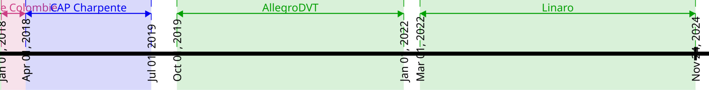

Pierrick Bouvier, Ingénieur Logiciel C++
========================================

AGE_KK ans, habite à Grenoble |
Téléphone: 06 72 14 82 97 |
Email: pierrick.bouvier@posteo.net

Site: https://second-reality.github.io |
Github: `second-reality <https://github.com/second-reality>`_ |
`pbo-linaro <https://github.com/pbo-linaro>`_ (pro)

Actuellement: Ingénieur Logiciel chez `Linaro <https://www.linaro.org>`_ |
Télétravail complet

Ce que j'aime
-------------

Développer une vision d'ensemble, et créer de nouvelles expériences utilisateur.
J'aime apporter un regard neuf sur des choses qui semblent figées, et les
améliorer.

À la recherche d'un environnement ouvert à ce changement, et où je puisse
apporter une philosophie et un outillage digne de notre temps. J'apprécie de
pouvoir apprendre des autres, et leur transmettre en retour.

Formation
---------

:2008 - 2011:

  Ingénierie des Systèmes d’Information - **GrenobleINP Ensimag**

:2006 - 2008:

  Licence Informatique et Mathématiques - Université Joseph Fourier de Grenoble

Compétences
-----------

:Langages:

  C++, C, `D <https://dlang.org/>`_, Python, Bash | *En progression*: Rust

:Librairies C++:

  STL, Boost (Conteneurs, Asio, Test), GoogleTest, Qt

:Atouts:

  Architecture, Algorithmes, Parallélisme | IT, Automatisation, Build, Tests, CI/CD

:Outils (dev):

  Bash, Vim, Git | GNU toolchain, Clang, CMake

:Outils (team):

  Gitlab, Jenkins, Docker

:Systèmes:

  Linux (Debian) | Windows

:Langues:

  Anglais: parlé et écrit couramment | Espagnol: parlé couramment

Expériences
-----------

.. image:: ./cv_timeline00.jpg
   :width: 100%
   :alt: timeline

**Ingénieur Logiciel chez Linaro** en télétravail complet (depuis mars 2022)

Élargir l'écosystème Arm sous Windows (Projet `WoA <https://www.linaro.org/windows-on-arm>`_).

C++, Python, Bash | Gitlab

- Portage de projets open source pour Windows on Arm. Contributions sur:
  Dart/Flutter, v8, Node.js, LLVM, ...
- Mise en place d'une CI basée sur Gitlab (+ administration des machines)
- Écriture d'articles de blog

**Ingénieur Logiciel R&D chez AllegroDVT** à Meylan (2+ ans)

Conception de `streams de conformité
<https://www.allegrodvt.com/video-ip-compliance-streams/products-compliance-streams/>`_
pour valider les implémentations de nouveaux standards vidéos.

D, C++17, Bash, Rust | Docker, Gitlab, Jenkins

- Lead technique de l'équipe (7 personnes)
- Architecture et développement d'un nouveau moteur de génération vidéo
- Développement pour les nouveaux standards (AVS3, H.266/VVC)
- Formation en interne sur notre générateur auprès des autres équipes
- Migration vers git (et gitlab) et formation pour l'équipe
- Mise en place d'une CI *efficace* (< 10 min) et d'un workflow basé sur Merge requests (gitlab)
- Automatisation complète de la chaîne de production (CD) en "un clic"!

|

**CAP Charpente**, au Greta de Grenoble (1 an)

L'occasion d'apprendre un métier manuel, désir que j'avais depuis longtemps, et
d'en découvrir les avantages et inconvénients comparé à mon métier d'ingénieur.
C'est une expérience importante dans ma vie professionnelle.

|

**Ingénieur de recherche chez INRIA** à Grenoble, au sein de l'équipe `CORSE
<https://team.inria.fr/corse/>`_ (1 an)

Développement d'un outil d'analyse de performances par instrumentation basé sur
QEMU (exemple ici_ pour ce programme_)

C++14, Python | code disponible sur github_

.. _github: https://github.com/second-reality/qemu/
.. _ici: https://second-reality.github.io/_static/projets/program_profiler/index.html
.. _programme: https://second-reality.github.io/_static/projets/program_profiler/main.c

|

**Ingénieur R&D chez Kaizen Solutions** en prestation chez **Thales Electron
Devices** à Moirans (1 an)

Portage d'une chaîne de traitement d'images sur GPU pour réduire la
consommation.

C++14, Cuda 7, OpenCL 1.2, Bash, Boost (Asio), CMake

- Autoformation CUDA/OpenCL et programmation GPGPU.
- Écriture d'algorithmes de traitement d'images
- Mise en place de cross compilation (arm, arm64, mips), test, profiling

|

**Ingénieur au CRD Nicolas Bourbaki** à Montbonnot (6 mois - liquidation entreprise)

Lead développeur sur une solution de communication complète pour l'IoT (réseau LoRa)

C++14, Bash, Boost (Asio, Log, UnitTest)

Licenciement économique suite à une liquidation totale de l'entreprise, qui
était hélas déjà en difficulté avant mon arrivée.

|

**Ingénieur compilation chez MathWorks** à Montbonnot (2+ ans)

Travail sur l'analyseur statique de code Polyspace

C, C++11, Standard ML, Bash | Jenkins

- Support de nouveaux standards (notamment C++11) | Résolution de bugs
- Création d'un outil de configuration automatique depuis le build du client:
  polyspace-configure
- Mise en place de git en parallèle de CVS (fournit par l'entreprise)
- Mise en place CI parallèle à celle de l'entreprise pour raccourcir le temps de
  feedback. (Délai réduit: semaine -> journée)

|

**Stage de fin d’études Ensimag au sein de l'équipe compilation de
STMicroelectronics** à Grenoble (6 mois)

Réalisation d’un logiciel permettant d’analyser la structure de grands projets
(Linux, LLVM, ...) au niveau binaire.

C99, XML, libelf, libdwarf.

Personnel
---------

* Montagne: VTT, randonnée, ski, escalade
* Moto
* Cinéma
* **Veille technologique (software & hardware)**
